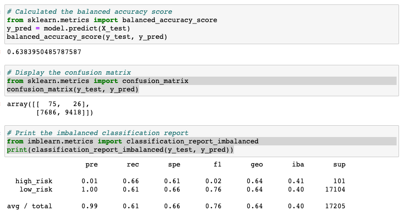
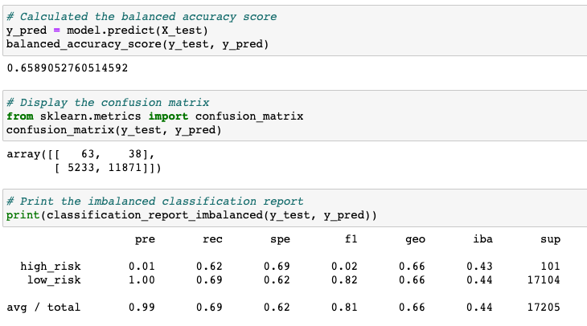
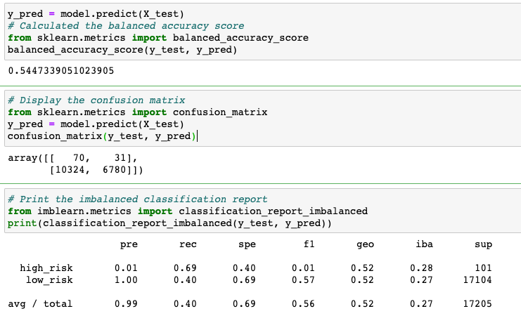
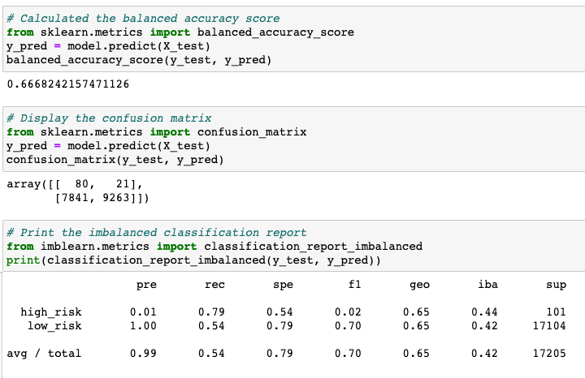
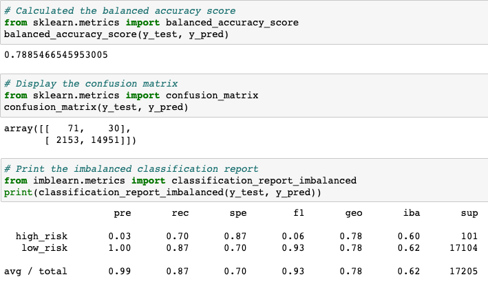
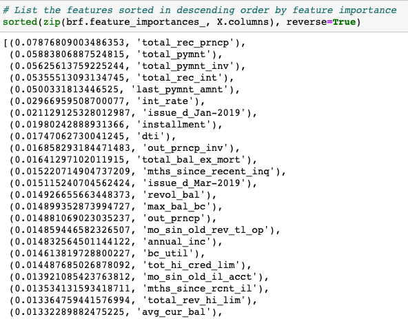
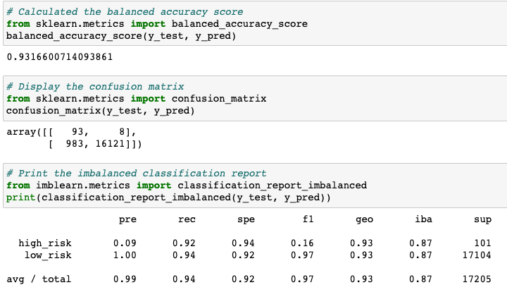

# Credit_Risk_Analysis
Author: Jerome Simmons

## Overview of the Analysis
Using credit card data from LendingClub, I have applied different sampling techniques to build predictive models that assesses credit risk. I have oversampled the data using the RandomOverSampler and SMOTE algorithms and undersampled the data using ClusterCentroids algorithm. I took a combinatorial approach of over- and undersampling using the SMOTEENN algorithm. Upon assessing results from these four methods, I applied a Balanced Random Forest Classifier and an Easy Ensemble Classifier ot predict credit risk. In the sections below, I walkthrough the results of all six approaches by assessing the balanced accuracy score, the precision, and the recall scores.

## Results
Below is an analysis of all six modeling approaches based on balanced accuracy score, the precision, and the recall scores.

#### Naive Random Oversampling Results
* Balanced Accuracy Score: 63.8%
* Precision: 0.01 for high risk, which is very low and indicates a lot of unreliable false positives. The model produced a 1.0 for low risk groups, which is very high.
* Recall: 0.66 for high risk and 0.61 for low risk, which is reasonably reliable. However, this is lower than we would like as we want to ensure we're appropriately lend out credit. The average was a 0.61.
* Overall: We can probably do better with a different approach.

#### SMOTE Oversampling Results
* Balanced Accuracy Score: 65.9% is a slight improvement upon our Naive Random Oversampling Results.
* Precision: 0.01 for high risk, which is very low and indicates a lot of unreliable false positives. The model produced a 1.0 for low risk groups, which is very high. No change over the previous model.
* Recall: 0.62 for high risk and 0.69 for low risk, which is reasonably reliable. The average recall was 0.69, which is an improvement over the previous model, but we should continue exploring models.
* Overall: This model improved upon the Oversampling model, but is still not good enough.

#### Undersampling Results
* Balanced Accuracy Score: 54.5% is a sharp decline compared to our previous two models, which had accuracy rates above 63%.
* Precision: 0.01 for high risk, which is very low and indicates a lot of unreliable false positives. The average precision is 0.99, which is no change over the previous model.
* Recall: 0.69 for high risk and 0.40 for low risk, which is a deterioration from the previous model. The average recall was 0.40, which is very low and below previous model. We should continue exploring models.
* Overall: This model is much worse than the SMOTE & Oversampling models.

#### Combination SMOTEEN over & undersampling Results
* Balanced Accuracy Score: 66.7% is an improvement over the last model, but still in line with the SMOTE results (65.9%).
* Precision: 0.01 for high risk, which is very low and indicates a lot of unreliable false positives. The average precision is 0.99, which is no change over the previous models.
* Recall: 0.79 for high risk and 0.54 for low risk, which is an improvement from the previous model. However, with an average recall of 0.54, this model performs worse than the Oversampling approaches.
* Overall: This model is worse than the SMOTE & Oversampling models, so we should continue exploring models.

#### Balanced Random Forest Classifier Results
* Balanced Accuracy Score: 78.8% is a significant improvement over all of the models and our best performing model yet.
* Precision: 0.03 for high risk, which is very low and indicates a lot of unreliable false positives. The average precision is 0.99, which is no change over the previous models.
* Recall: 0.70 for high risk and 0.87 for low risk, which indicates few False Negatives. With an average recall of 0.87, this model is much better than all other models.
* Overall: The Balanced Random Forest Classifier is the best performing model yet insofar as predicting results accurately and minimizing false negatives with a high recall. In terms of precision, the model is generally on par with the other models.

* The feature importance data below shows that the Balanced Random Forest Classifier model had a five standout features (importance > 0.05), and many features with an importance rating below 0.02. It's important to note that there were 95 features utilitized by the model.

#### Easy Ensemble AdaBoost Classifier Results
* Balanced Accuracy Score: 93.1% is a significant improvement over all of the models and our best performing model.
* Precision: 0.09 for high risk, which is very low and indicates a lot of unreliable false positives. However, this is still three times as large as our highest performing model on high risk users (0.03). The average precision is 0.99, which is no change over the previous models.
* Recall: 0.92 for high risk and 0.94 for low risk, which indicates very few False Negatives. With an average recall of 0.94, this model is our highest performing model.
* Overall: The Easy Ensemble Classifier is the best performing model insofar as predicting results accurately and minimizing false negatives with a high recall. In terms of precision, the model is generally on par with the other models.

## Summary
Among all six models, the Easy Ensemble AdaBoost Classifier produced the best results in terms of predicting high and low risk users. The model overperfromed in terms of predicting results accurately and maximizing high recall. Although the model was generally on par with the other five models in terms of precision, we are more concerned about high recall with Credit Risk data. High Recall on High Risk groups means that we fewer loan write downs as the number who are scored as high risk are actually high risk. It could be very expensive to score a customer as low risk, when they are indeed a high risk customer. As such, we feel comfortable moving forward with the Easy Ensemble AdaBoost Classifier model in order to determine if a user is low or high risk.
